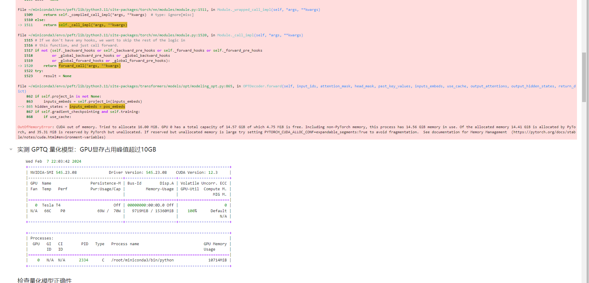

# 问题说明：

因在使用 GPTQ 量化 facebook\opt-6.7b 模型时，训练机（华为云）的T4显卡，显存有16GiB

按照课程中老师提到的最低配置，16GiB显存应符合量化该模型的最低配置，但实际情况是，在量化时 out of memory

故提交了一下两份 opt-2.7b 量化的 jupyter页，作为替代:
1. GPTQ 量化 facebook\opt-2.7b 模型的结果，参考目录 gptq_quantize_opt-2.7b
2. AWQ 量化 facebook\opt-2.7b 模型的结果，参考目录 awq_quantize_opt-2.7b

## 显存 OOM 的报错参考如下截图：
1. 量化时报错

2. 报 CUDA out of memory 

3. nvidia-smi 显示当时的显存使用情况，只剩 400MiB 可用
